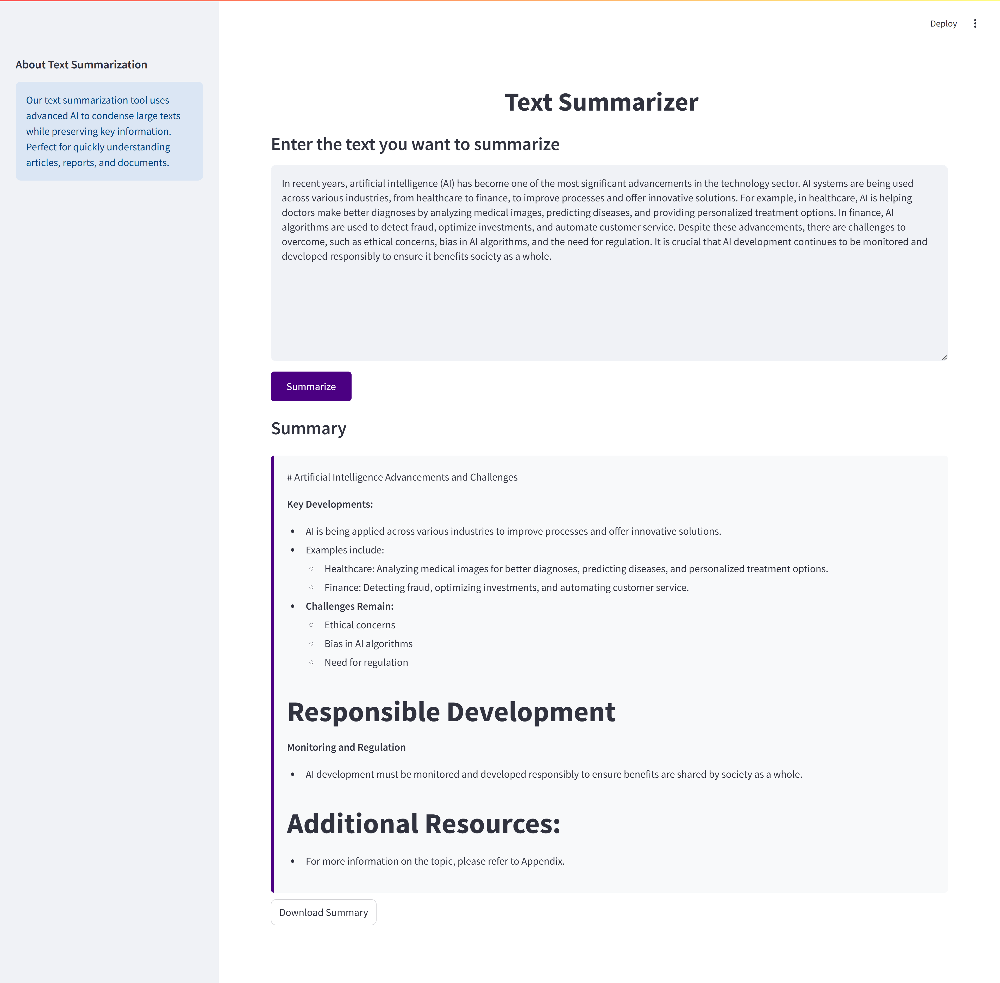
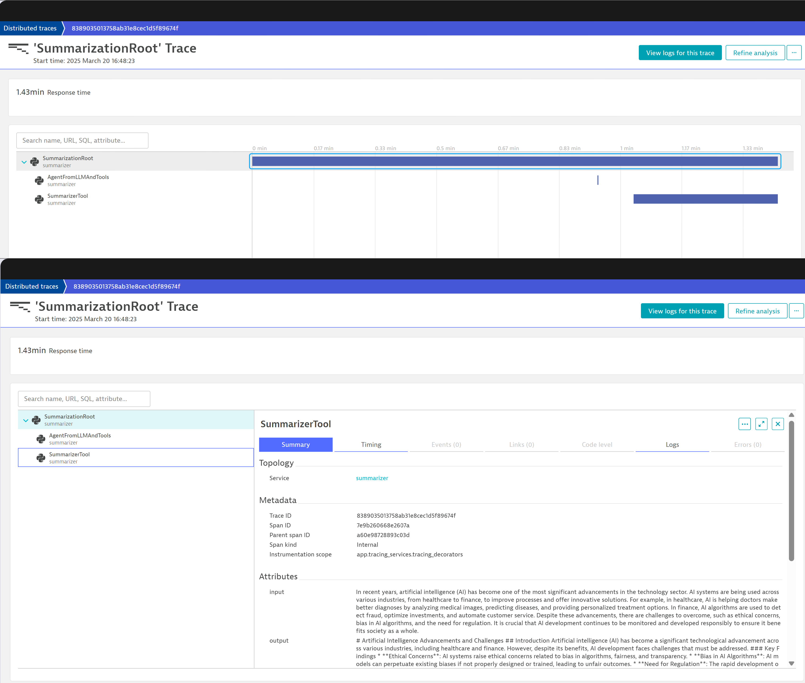

# **AI-Powered Text Summarization Agent** 📝🤖  


## **🚀 Overview**  
This project provides a user-friendly AI-powered **text summarization bot** that helps users quickly condense long texts while preserving key information. The system is designed as an API-based solution with a **Streamlit frontend** for interaction.  

The backend is powered by **[BCG AgentKit](https://github.com/BCG-X-Official/agentkit/)**, a robust framework for building AI agents, and integrates **Dynatrace OpenTelemetry** to **export traces** for monitoring AI performance and system health.  

It leverages **Ollama and OpenAI's language models** for accurate and context-aware text summarization. The entire workflow is **orchestrated via Langchain**, ensuring smooth AI interactions. 

  

---

## **🛠️ Tech Stack**  

| Component       | Technology Used |
|----------------|----------------|
| **Frontend**   | Streamlit (Python-based web framework) |
| **Backend**    | Python + [BCG AgentKit](https://github.com/BCG-X-Official/agentkit/) |
| **AI/ML**      | Ollama + OpenAI API |
| **Monitoring** | Dynatrace + OpenTelemetry |
| **Orchestration** | Langchain |
| **Containerization** | Docker |
| **Cloud Platform** | Microsoft Azure (Azure Container Instances) |
| **Version Control** | Git |

---

## **📌 Features**  
✅ **AI-based summarization**: Uses OpenAI's models for concise, meaningful text summaries.  
✅ **User-friendly interface**: Simple web app built with **Streamlit**.  
✅ **Backend powered by BCG AgentKit**: Utilizes **[BCG AgentKit](https://github.com/BCG-X-Official/agentkit/)** for efficient AI agent interactions.  
✅ **Scalable & cloud-deployable**: Runs on **Azure Container Instances** for seamless scaling.  
✅ **End-to-end monitoring**: Integrated with **Dynatrace** via **OpenTelemetry** for exporting traces and performance insights.  
✅ **Efficient orchestration**: Uses **Langchain** to manage AI tasks efficiently.  
✅ **Containerized deployment**: Packaged with **Docker** for portability.  

## **🖥️ Installation & Setup**  

### **1️⃣ Clone the Repository**  
```bash
git clone https://github.com/Chaimaaorg/SummarizeBot.git
cd SummarizeBot
```

### **2️⃣ Configure Environment Variables**  
- Rename `.env.example` to `.env`:  
  ```bash
  mv .env.example .env
  ```  
- Open `.env` and **fill in your personal API keys** (e.g., OpenAI API key, Dynatrace credentials, etc.).

### **3️⃣ Build and Run the Docker Containers**  
Use `docker-compose` to set up and launch the services:  
```bash
docker-compose up --build
```

### **4️⃣ Add Ollama Models**  
Once the **Ollama image** is built, you need to add the required models:  
```bash
docker exec -it ollama_summarizer bash
ollama pull llama3.2:1b  # Example model
exit
```
*(Replace `llama3.2:1b` with the model of your choice if needed.)*

### **5️⃣ Restart the Containers**  
After pulling the models, **restart** the service:  
```bash
docker-compose up --build
```

### **6️⃣ Access the Bot**  
Once running, navigate to:  
➡️ **[http://localhost:8501/](http://localhost:8501/)** to interact with the summarization bot! 🎯🚀  

---

## **📊 Monitoring with Dynatrace & OpenTelemetry**  
This project **exports traces** to **Dynatrace** using **OpenTelemetry**, ensuring real-time observability and debugging capabilities.  

### **How Monitoring Works**  
✔ **Traces AI interactions and API requests.**  
✔ **Monitors response times, latency, and errors.**  
✔ **Provides performance insights into AI-generated summaries.**  

📊 **Dynatrace dashboards** allow real-time visualization of AI agent activity and system health.  
  
---

## **🛠️ Architecture Overview**  
```
+-----------------------+
|      User Input       |
+-----------------------+
         ↓
+-----------------------+
|      Streamlit UI     |
+-----------------------+
         ↓
+-----------------------+
|   FastAPI Backend     |
|  (BCG AgentKit-based) |
+-----------------------+
         ↓
+-----------------------+
|   Langchain Agent     |
+-----------------------+
         ↓
+-----------------------+
|   Ollama + OpenAI API |
+-----------------------+
         ↓
+-----------------------+
|   Dynatrace Tracing   |
|  (via OpenTelemetry)  |
+-----------------------+
         ↓
+-----------------------+
|     Summarized Text   |
+-----------------------+
```

---

## **👨‍💻 Author & Contributions**  
Developed by **Chaimaâ Ourgani** 🚀  
Feel free to contribute via Pull Requests!  
